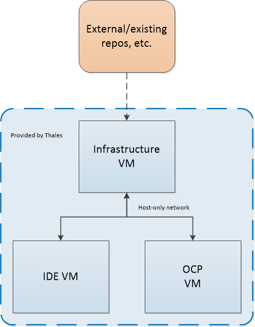

# StackinaBox project

## What is Stack-in-a-Box?

Stack-in-a-Box is a pre-built development environment consisting of three virtual machines that simplify the use of OpenShift Container Platform (OCP) and offer an approach to Continuous Integration and Continuous Deployment (CI/CD).

The project consists of an IDE VM and another VM with an OpenShift cluster for deployment. There is also an infrastructure VM containing the Red Hat repositories, image registries, and plug-ins required to fulfil the disconnected development machines.

--------------------------------------

## Software to be included:

### IDE VM

ide.thales.com 10.0.2.2

This VM contains development tools and Eclipse IDE to allow development of applications which can be deployed to the OpenShift cluster running in the deployment VM

* devtoolset
* git client
* maven
* Eclipse 2019-09
    * CodeReady plug-in for OpenShift development
    * PyDev plug-in for Python development
    * CDT plug-in for C++ development
    * Spring IDE
    * JBoss Maven Spring Boot Configurator

_RHEL 7 VM_
- 8Gb RAM
- 1 CPU
- 20Gb hard disk
- Host-only adapter (disconnected)

--------------------------------------------

### OCP VM

ocp.thales.com 10.0.2.1

This VM hosts an All-in-One (AIO) OpenShift Container Platform cluster. 

Inside the OCP will be pre-installed containers as follows:

- Jenkins for CI/CD pipeline (see below)
- Sonarqube for code quality analysis
- Kafka cluster for testing purposes

Also inside the Deployment VM there are:

- Gitea
- Nexus

_RHEL 7 VM_
- 24 Gb RAM
- 8 cores
- 100 Gb hard disk
- Host-only adapter (disconnected)

------------------------------------------

### Infra VM

repo.thales.com 10.0.2.3

This VM contains Red Hat repositories, image registry, and various other files required to provision the OpenShift deployment VM. The VM runs Apache HTTP server to serve the various files to the deployment VM

* Red Hat repos
* Required images

 _RHEL 7 VM_
 - 2Gb RAM 
 - 1 CPU 
 - 200Gb hard disk 
 - NAT adapter for internet connection 
- Host only adapter for connection between VMs 